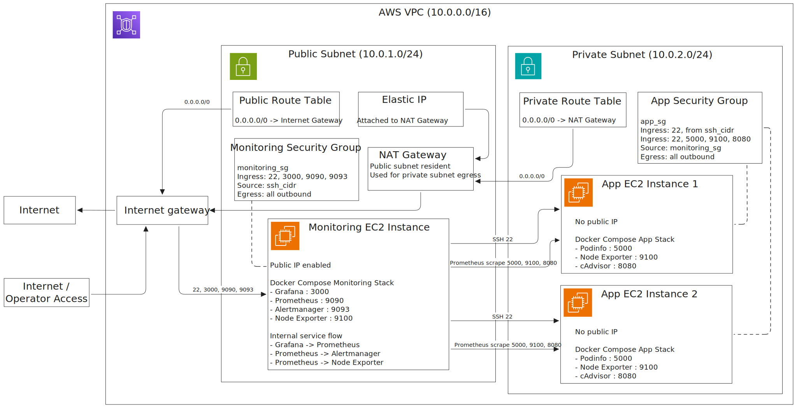

# AutoOps Platform

Infrastructure automation and monitoring project for AWS, built with Terraform and Ansible.

## Current Status

The repository currently includes:

- **Terraform infrastructure** for:
  - VPC, public/private subnets, route tables, NAT gateway
  - EC2 instances (monitoring node + app nodes)
  - Security groups for SSH and monitoring traffic
  - Remote state bootstrap (S3 + DynamoDB lock table)
- **Ansible automation** for:
  - Base bootstrap (`bootstrap.yml`) on all nodes
  - Monitoring stack deployment (`monitoring.yml`)
  - App stack deployment (`app.yml`)
- **Monitoring stack** (Docker Compose):
  - Prometheus
  - Alertmanager
  - Grafana
  - Node Exporter (monitoring node and app nodes)
  - cAdvisor (app nodes)
  - Demo app (`stefanprodan/podinfo`)
- **Grafana provisioning**:
  - Prometheus datasource
  - Auto-provisioned dashboard(s)
- **Alerting**:
  - Prometheus alert rules
  - Alertmanager integration for Discord webhook notifications

All main playbooks are tested as **idempotent**.

## Repository Layout

- `terraform/` - Infrastructure as Code
  - [`bootstrap/`](terraform/bootstrap/README.md) - Remote state management (S3/DynamoDB)
  - [`envs/dev/`](terraform/envs/dev/README.md) - Development environment root module
  - `modules/` - Reusable components ([`vpc`](terraform/modules/vpc/README.md), [`ec2`](terraform/modules/ec2/README.md), [`security`](terraform/modules/security/README.md))
- `ansible/` - Configuration management
  - `playbooks/` - Core automation logic (`bootstrap`, `monitoring`, `app`)
  - `templates/` - Jinja2 configs for Grafana, Prometheus, and Docker Compose

## Architecture

Current runtime architecture for the `dev` environment:



Source diagram: [docs/architecture/autoops-architecture.excalidraw](docs/architecture/autoops-architecture.excalidraw)

## Quick Start: Infrastructure (Terraform)

This project uses remote state and is heavily integrated with **GitHub Actions** for CI/CD validation. 

For full deployment instructions, refer to the [dev environment README](terraform/envs/dev/README.md).
1. Deploy the initial [State Bootstrap](terraform/bootstrap/README.md).
2. Configure your variables: `cp terraform/envs/dev/terraform.tfvars.example terraform/envs/dev/terraform.tfvars`
3. (Local testing) Run `terraform plan` and `terraform apply` within the `terraform/envs/dev/` directory.

## Quick Start: Configuration (Ansible)

From an environment with Ansible installed (e.g., WSL/Linux shell), run the playbooks sequentially to deploy the components onto the provisioned infrastructure:

```bash
ANSIBLE_CONFIG=/mnt/c/projektid/AutoOps-Platform/ansible/ansible.cfg \
ansible-playbook -i /mnt/c/projektid/AutoOps-Platform/ansible/inventory.ini \
/mnt/c/projektid/AutoOps-Platform/ansible/playbooks/bootstrap.yml

ANSIBLE_CONFIG=/mnt/c/projektid/AutoOps-Platform/ansible/ansible.cfg \
ansible-playbook -i /mnt/c/projektid/AutoOps-Platform/ansible/inventory.ini \
/mnt/c/projektid/AutoOps-Platform/ansible/playbooks/monitoring.yml

ANSIBLE_CONFIG=/mnt/c/projektid/AutoOps-Platform/ansible/ansible.cfg \
ansible-playbook -i /mnt/c/projektid/AutoOps-Platform/ansible/inventory.ini \
/mnt/c/projektid/AutoOps-Platform/ansible/playbooks/app.yml
```

For Discord alerts on the monitoring stack, you can pass a webhook URL at runtime using the `discord_webhook_url` variable.
